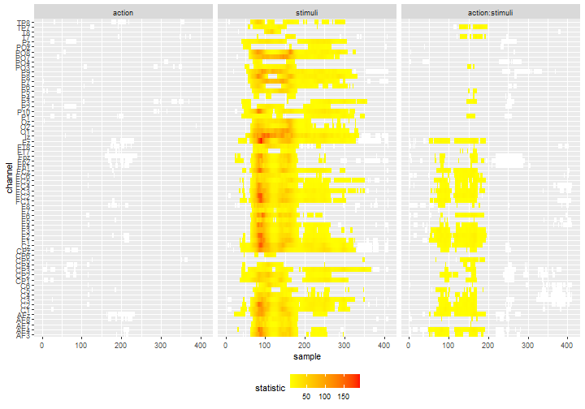

```{r setup, include = FALSE}
library(knitr)
knitr::opts_chunk$set(
  collapse = TRUE,
  comment = "#>"
)
myeval = F
```


`permuco4brain` has currently 2 built-in functions for plotting. The `image()` function provides a heatmap of the results for 1 effect and the `plot()` function draws the adjacency graph for 1 time and 1 effect where the vertices are colored depending and the $p$-value. These functions are fast but not easy to custom. Hence they are useful for checking results of the test but are may not be useful for publication purpose. 

In this vignette, we show how to extract the results of the test to produce 3 types of graphical representations using `ggplot2` [@ggplot2]. These function may be slower to run but provides plots that can be custom for publication.

We assume that you have already run the example in the `download-example-cheval` included in `permuco4brain`:

```{r eval=FALSE, include=TRUE}
devtools::install_github("jaromilfrossard/permuco4brain", build_vignettes = TRUE)
vignette("download-example-cheval",package = "permuco4brain")
```

In the `download-example-cheval` vignette, the final step is to perform test on a repeated measures ANCOVA model using `signal ~ action*stimuli*mvpa_c + Error(participant/(action*stimuli))`. In the following tutorial, we will assume the same data-set but adjusting a slightly simpler model, using the formula: `signal ~ action*stimuli + Error(participant/(action*stimuli))`.


## The heat-map

In this section, we create a similar heat-map than the `image()` function applied to a `brainperm` object. We need the following package:

```{r eval=myeval, message=FALSE, warning=FALSE, include=TRUE}
library(permuco)
library(permuco4brain)
library(tidyverse)
library(ggplot2)
library(igraph)
```

Make sure to load the `brainperm` model:

```{r eval=F, message=FALSE, warning=FALSE, include=TRUE}
load("model.RData")
```


```{r eval=myeval, message=FALSE, warning=FALSE, include=F}
load("../model.RData")
```

We need first to get the channel's attributes saved in the `igraph` object. We need from this object the spatial position of the channels.

```{r eval=myeval, message=FALSE, warning=FALSE, include=TRUE}
chan_tbl <- get.vertex.attribute(model$graph)%>%
  as_tibble()
```


Next we get the results of the test by specifying the `table_type = "full"` argument from the `summary()` method. It produces a list with a table per effect/interaction. Here we transform it into a large table:

```{r eval=myeval, message=FALSE, warning=FALSE, include=TRUE}
### test tibble
df_gg <- summary(model, table_type = "full")
df_gg <-
  tibble(effect = names(df_gg),
         data = df_gg)%>%
  unnest(data)
```

Next we merge the channel's information to the data-frame with the tests information:

```{r eval=myeval, message=FALSE, warning=FALSE, include=TRUE}
### add channel info
df_gg <- df_gg%>%
  nest(data = -channel)%>%
  left_join(chan_tbl, by = c("channel" = "name"))
```


We sort the channels and effects which will be is useful for ordering the panels:

```{r eval=myeval, fig.height=6, fig.width=7, message=FALSE, warning=FALSE, include=TRUE}
### order channel
df_gg <- df_gg%>%
  arrange(y, desc(x))%>%
  mutate(order = 1:n())%>%
  mutate(channel = fct_reorder(channel, order, min))%>%
  select(-order)%>%
  unnest(data)%>%
  mutate(effect = fct_relevel(effect, c("action", "stimuli", "action:stimuli")))
```


In the heat-map, we represent the test below the threshold transparent, the non-significant clusters in white and the significant clusters colored accordingly to their $p$-value:

```{r eval=myeval, fig.height=6, fig.width=7, message=FALSE, warning=FALSE, include=TRUE}
df_gg%>%
  ggplot() +
  geom_tile(data = .%>%filter(cluster_id != 0, pvalue >= 0.05),
            aes(x = sample, y = channel), fill = "white") +
  geom_tile(data = .%>%filter(cluster_id != 0, pvalue < 0.05),
            aes(x = sample, y = channel, fill = pvalue)) +
  scale_fill_gradientn(colours = c("red", "yellow"),
                       limits = c(0, 0.05)) +
  facet_grid(col = vars(effect)) +
  theme(legend.position = 'bottom')
```

```{r eval=myeval, message=FALSE, warning=FALSE, include=F}
ggsave(filename = "figure_ggplot2_heatmap_pval.png",dpi = 72, height = 7,width = 10, units = "in")
```


We can slight change the coloring by choosing to display the observed statistics of the individual tests. It may provide a good visual information of which time-points or channels drive the effect.

```{r eval=myeval, fig.height=6, fig.width=7, message=FALSE, warning=FALSE, include=TRUE}
df_gg%>%
  ggplot() +
  geom_tile(data = .%>%filter(cluster_id != 0, pvalue >= 0.05),
            aes(x = sample, y = channel), fill = "white") +
  geom_tile(data = .%>%filter(cluster_id != 0, pvalue < 0.05),
            aes(x = sample, y = channel, fill = statistic)) +
  scale_fill_gradientn(colours = c("yellow", "red")) +
  facet_grid(col = vars(effect)) +
  theme(legend.position = 'bottom')
```

```{r eval=myeval, message=FALSE, warning=FALSE, include=F}
ggsave(filename = "figure_ggplot2_heatmap_stat.png",dpi = 72, height = 7,width = 10, units = "in")
```




## The signals on grid

In EEG analysis, it is common to plot the ERP of each channel on the representation of the head. This type representation usually displays the data or average per group but we adapt it to display the statistical signal for each effect. We will use the `geofacet` [@geofacet] package and its web-app to construct the grid. 

We need the following package:


```{r eval=myeval, message=FALSE, warning=FALSE, include=T}
library(permuco)
library(permuco4brain)
library(tidyverse)
library(ggplot2)
library(igraph)
library(geofacet)
```


First we use the `table_type = "full"` from the `summary()` method to get the result from all the tests (all effects, all time points, all channels) and we store it in a data-frame:

```{r eval=myeval, message=FALSE, warning=FALSE, include=T}
df_gg <- summary(model, table_type = "full")
df_gg <- tibble(effect = names(df_gg),
                data = df_gg)%>%
  unnest(data)
```

We get the position from the channels by getting the attributes of the graph:

```{r eval=myeval, message=FALSE, warning=FALSE, include=T}
chan_tbl = get.vertex.attribute(model$graph)%>%
  as_tibble()
```


Then we use an internal function from `eeguana` [@nicenboim_eeguana_2020] to transform the 3D coordinate system into 2D:

```{r eval=myeval, message=FALSE, warning=FALSE, include=T}
chan_polar <- eeguana:::polar(chan_tbl%>% pull(x),
                              chan_tbl%>% pull(y),
                              chan_tbl%>% pull(z))%>%
  as_tibble()%>%
  rename(x_pol = "x", 
         y_pol = "y")

chan_tbl <- chan_tbl%>%
  bind_cols(chan_polar)
```


Next we transform the position of the channel in order to simplify the creation of the grid as we need positive and integer values:

```{r eval=myeval, message=FALSE, warning=FALSE, include=T}
df_grid = chan_tbl%>%
  select(name, x_pol, y_pol)%>%
  transmute(name = name,
            code = name,
            row = as.integer(round(y_pol*5)),
            col = as.integer(round(x_pol*5)))%>%
  mutate(row = row - min(row),
         row = max(row) - row + 1,
         col = col - min(col) + 1)
```

Then, running the function `grid_design()` launches the web-app from `geofacet` on your browser. It allows to fine-tune the position of each channel and copy-paste the resulting data-frame.

```{r eval=myeval, message=FALSE, warning=FALSE, include=T}
# grid_design(data= df_grid)
df_grid <- data.frame(
  name = c("Fp2", "Fp1", "Fpz", "AF4", "AF3", "AFz", "AF8", "AF7", "Fz", "F2", "F1", "F3", 
           "F4", "F6", "F5", "F8", "F7", "FT8", "FT7", "FC5", "FC3", "FC1", "FCz", "FC2", 
           "FC4", "FC6", "T7", "C5", "C3", "C1", "Cz", "C2", "C4", "C6", "T8", "CP3", "CP1", 
           "CPz", "CP2", "CP4", "CP6", "CP5", "TP8", "TP7", "P7", "P5", "P3", "P1", "Pz", 
           "P2", "P4", "P6", "P8", "P10", "P9", "PO7", "PO3", "POz", "PO4", "PO8", "O1", 
           "Oz", "O2", "Iz"),
  code = c("Fp2", "Fp1", "Fpz", "AF4", "AF3", "AFz", "AF8", "AF7", "Fz", "F2", "F1", "F3", 
           "F4", "F6", "F5", "F8", "F7", "FT8", "FT7", "FC5", "FC3", "FC1", "FCz", "FC2", 
           "FC4", "FC6", "T7", "C5", "C3", "C1", "Cz", "C2", "C4", "C6", "T8", "CP3", "CP1", 
           "CPz", "CP2", "CP4", "CP6", "CP5", "TP8", "TP7", "P7", "P5", "P3", "P1", "Pz", "P2", 
           "P4", "P6", "P8", "P10", "P9", "PO7", "PO3", "POz", "PO4", "PO8", "O1", "Oz", "O2", 
           "Iz"),
  row = c(1, 1, 1, 2, 2, 2, 2, 2, 3, 3, 3, 3, 3, 3, 3, 3, 3, 4, 4, 4, 4, 4, 4, 4, 4, 4, 5, 5, 
          5, 5, 5, 5, 5, 5, 5, 6, 6, 6, 6, 6, 6, 6, 6, 6, 7, 7, 7, 7, 7, 7, 7, 7, 7, 7, 7, 8, 
          8, 8, 8, 8, 9, 9, 9, 10),
  col = c(7, 5, 6, 8, 4, 6, 10, 2, 6, 7, 5, 4, 8, 9, 3, 10, 2, 10, 2, 3, 4, 5, 6, 7, 8, 9, 2, 
          3, 4, 5, 6, 7, 8, 9, 10, 4, 5, 6, 7, 8, 9, 3, 10, 2, 2, 3, 4, 5, 6, 7, 8, 9, 10, 11, 
          1, 2, 4, 6, 8, 10, 4, 6, 8, 6),
  stringsAsFactors = FALSE)
```

The final plot is created by using the grid and highlighting the time-points in significant clusters. Here is the example for the interaction:

```{r eval=myeval, message=FALSE, warning=FALSE, include=T}
df_gg%>%
  filter(effect == "action:stimuli")%>%
  ggplot()+
  geom_ribbon(data =.%>%
                mutate(statistic = if_else(pvalue<0.05, statistic, NA_real_)),
              aes(x = sample,ymin = 0, ymax = statistic), fill = "red")+
  geom_line(aes(x = sample, y = statistic))+
  labs(x = "", y = "")+
  facet_geo(~channel, grid = df_grid)+
  theme(axis.title = element_blank(),
        axis.text.x = element_text(angle = 90))
```


```{r eval=myeval, message=FALSE, warning=FALSE, include=F}
ggsave(filename = "figure_ggplot2_signal_grid.png",dpi = 72, height = 9,width = 9, units = "in")
```


## The graph of the channels

In the following section, we plot the graph of adjacency of the channel for 1 sample by highlighting the channels belonging to significant clusters. It produces an accurate representation the clusters at a precise time-point.

In addition to the usual package we need `ggforce` [@ggforce] as it facilitates the representation of the channels (using `geom_circle()`).

```{r eval=myeval, message=FALSE, warning=FALSE, include=T}
library(permuco)
library(permuco4brain)
library(tidyverse)
library(ggplot2)
library(igraph)
library(ggforce)
```


As previously, we get the channels position data:

```{r eval=myeval, message=FALSE, warning=FALSE, include=T}
chan_tbl = get.vertex.attribute(model$graph)%>%
  as_tibble()
```

We compute their 2D projection using the hidden function from `eeguana`:

```{r eval=myeval, message=FALSE, warning=FALSE, include=T}
chan_polar <- eeguana:::polar(chan_tbl%>% pull(x),
                              chan_tbl%>% pull(y),
                              chan_tbl%>% pull(z))%>%
  as_tibble()%>%
  rename(x_pol = "x",y_pol = "y")

chan_tbl <- chan_tbl%>%
  bind_cols(chan_polar)
```

We store the data from the test in a data-frame:


```{r eval=myeval, message=FALSE, warning=FALSE, include=T}
df_gg <- summary(model, table_type = "full")
df_gg <-
  tibble(effect = names(df_gg),
         data = df_gg)%>%
  unnest(data)
```

And we merge data from test and the channel position:

```{r eval=myeval, message=FALSE, warning=FALSE, include=T}
df_gg <- df_gg%>%
  nest(data = -channel)%>%
  left_join(chan_tbl, by = c("channel" = "name"))%>%
  unnest(data)%>%
  mutate(effect = fct_relevel(effect, c("action", "stimuli", "action:stimuli")))
```

Next we use the channel position to compute the size of the channel. Here the radius of the circles will be the $1/5$ of the minimal distance between 2 channels.

```{r eval=myeval, message=FALSE, warning=FALSE, include=T}
rad <- 
  (chan_tbl%>%
  select(x_pol, y_pol)%>%
  dist()%>%
  min())/5
```

We get the data of the edges of the adjacency graph:

```{r eval=myeval, message=FALSE, warning=FALSE, include=T}
df_chan_pos <- 
  chan_tbl%>%
  select(channel = name, x_pol, y_pol)

edge_tbl = as_data_frame(model$graph, what = c("edges"))%>%
  as_tibble()%>%
  left_join(df_chan_pos, by = c("from" = "channel"))%>%
  rename(x_from = x_pol, y_from = y_pol)%>%
  left_join(df_chan_pos, by = c("to"="channel"))%>%
  rename(x_to = x_pol, y_to = y_pol)
```

In order to have a representation of the edges that fits nicely with the size of the circles, we reduce the length of each segment using simple triangle geometry formula:

```{r eval=myeval, message=FALSE, warning=FALSE, include=T}
edge_tbl<- 
  edge_tbl%>%
  mutate(slope = (y_from - y_to)/(x_from - x_to),
         dy = sqrt(rad^2/(1 + 1/slope^2)),
         dx = sqrt(rad^2/(1 + slope^2)))%>%
  transmute(from = from,to = to,
            x_from = if_else(x_from < x_to, x_from + dx, x_from - dx),
            x_to = if_else(x_from < x_to, x_to- dx, x_to + dx),
            y_from = if_else(y_from < y_to, y_from + dy, y_from - dy),
            y_to = if_else(y_from < y_to, y_to - dy, y_to + dy))
```

Finally, the plot the result for 1 time-frame:

```{r eval=myeval, message=FALSE, warning=FALSE, include=T}
df_gg%>%
  filter(sample%in%c(80))%>%
  ggplot()+
  geom_circle(data=.%>%filter(cluster_id == 0),
              aes(x0 = x_pol, y0 = y_pol,r = rad), fill="#00000000")+
  geom_circle(data=.%>%filter(cluster_id!=0&pvalue>0.05),
              aes(x0 = x_pol, y0 = y_pol,r=rad), fill="white")+
  geom_circle(data=.%>%filter(pvalue<0.05),
              aes(x0 = x_pol, y0 = y_pol,r=rad,fill=pvalue))+
  scale_fill_gradientn(colours = c("red","yellow"),
                       limits = c(0, 0.05))+
  geom_segment(data=edge_tbl, 
               mapping = aes(x = x_from, y = y_from, xend = x_to, yend= y_to),
               inherit.aes = F, col = "grey20")+
  geom_text(aes(x = x_pol, y = y_pol + 2.4*rad, label = channel))+
  coord_fixed()+
  facet_grid(sample~effect)+  
  theme(axis.title = element_blank(),
        axis.ticks = element_blank(),
        axis.text = element_blank(),
        legend.position = 'bottom')
```

```{r eval=myeval, message=FALSE, warning=FALSE, include=F}
ggsave(filename = "figure_ggplot2_graph_80.png",dpi = 72, height = 6,width = 9, units = "in")
```


Or several time-frames of 1 effect (here the interaction). We deleted the names of the channels not to overload the representation.

```{r eval=myeval, message=FALSE, warning=FALSE, include=T}
df_gg%>%
  filter(sample%in%(c(5:13)*10),effect=="action:stimuli")%>%
  ggplot()+
  geom_circle(aes(x0 = x_pol, y0 = y_pol,r = rad), fill = "#00000000")+
  geom_circle(data=.%>%filter(cluster_id!=0),
              aes(x0 = x_pol, y0 = y_pol,r = rad), fill = "white")+
  geom_circle(data=.%>%filter(pvalue<0.05),
              aes(x0 = x_pol, y0 = y_pol,r = rad,fill = pvalue))+
  scale_fill_gradientn(colours = c("red","yellow"),
                       limits = c(0, 0.05))+
  geom_segment(data = edge_tbl, 
               mapping=aes(x = x_from, y = y_from, xend = x_to, yend = y_to),
             inherit.aes = F, col = "grey20")+
  coord_fixed()+
  facet_wrap(~sample, ncol = 3)+ 
  theme(axis.title = element_blank(),
        axis.ticks = element_blank(),
        axis.text = element_blank(),
        legend.position = 'bottom')
```

```{r eval=myeval, message=FALSE, warning=FALSE, include=F}
ggsave(filename = "figure_ggplot2_graph_all.png",dpi = 72, height = 9,width = 9, units = "in")
```


# Reference
