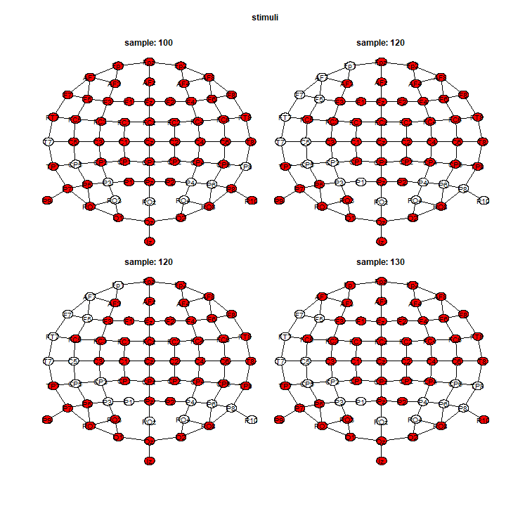

```{r, include = FALSE}
library(knitr)
knitr::opts_chunk$set(
  collapse = TRUE,
  comment = "#>"
)
```


## TFCE and default parameters

The threshold-free cluster-enhancement [@smith_thresholdfree_2009] (or TFCE) is a transformation of the statistical signal or map. After running the test for all voxels (samples $\times$ channels), we transformed the observed statistic $T_i$ for the voxel $i$ using:

$$
\text{TFCE}(i) = \int_{h=0}^{T_i} e_i(h)^E h^H \text{d} h.
$$

The TFCE does an integral over all the thresholds $h$. The function $e_i(h)$ is called the extend of the cluster created by the threshold $h$ and represents the number of test/voxel in that cluster. Finally, $E$ and $H$ are two additional parameters that are set _a priori_. The $p$-values for the voxel $i$ is computed by comparing its $\text{TFCE}(i)$ with the null distribution of the TFCE. For each permuted signal $T_i^\ast$, we keep the maximal $\max_i\left[\text{TFCE}^*(i) \right]$ for the null distribution of the TFCE.


In `permuco4brain`, we implement the suggestion from @pernet_clusterbased_2015 to use $E<1$. In `permuco4brain`, the default values are $E = 0.5$ and for a F statistic, $H = 1$  and for a $t$ statistic $H = 2$. 

Moreover,  by default in `permuco4brain`, the integral is estimated using `ndh = 500` steps. More precisely, the maximal over all statistics, ( all samples and all permutations) is equally divided into `ndh = 500` values for the $h$'s. All the default arguments for the TFCE can be changed by adding the arguments `E = ...`, `H = ...` or `ndh = ...` in the `brainperm()` function. 


Finally, the threshold-free cluster-enhancement [@smith_thresholdfree_2009] (or TFCE) is similar to the cluster-mass test in `permuco4brain`. However, the TFCE use more computational resources that the cluster-mass test and it must be consider before running the function.


## Running the TFCE

First, we activate the package `permuco4brain` [@permuco4brain] and  `future` [@future]

```{r package, eval = FALSE}
library(permuco4brain)
library(future)
```

Following the [vignette](https://jaromilfrossard.github.io/permuco4brain/articles/download-example-cheval.html), you may have saved the data (`signal` 3D array, an `igraph` object called graph and `data.frame` called `design`). We open the it using:

```{r load, eval = FALSE}
load("signal_design_graph.RData")
```

Using the `future` for multi-core processing, we set $2000$M RAM per workers by changing the options: 

```{r ram, eval = FALSE}
options(future.globals.maxSize = 2000 * 1024^2)
```

This value should mainly depends on the number of tests/voxel (here $64$ channels $\times$ $411$ times-points $26304$) and the number of steps in the approximation of the integral (here $500$). Moreover, the RAM per worker $\times$ the number of worker should not exceed the total RAM of your computer.


Using the `plan()` function we define a multi-core computing process with 6 `workers` and run the TFCE by simply specifying `multcomp = "tfce"`.

```{r tfce, eval = FALSE}
plan(multisession, workers = 6)
tfce <- brainperm(signal ~ action*stimuli*mvpa_c + Error(participant/(action*stimuli)),
                  data = design, graph = graph, multcomp = "tfce")
```

It should run for around half-hour per effect (here 7 effects).


Similarly to the cluster-mass test, we produce a heat-map using the `image()` function:

```{r heatmap, eval = FALSE}
image(tfce, effect = 2)
```


Or showing the results distributed in space:

```{r scalp, eval = FALSE}
plot(tfce, effect = 2, samples = c(100,120,120,130))
```



And, we extract the results for all effects, all time-points, all channels, using the `summary()` function. 

```{r summary, eval = FALSE}
tfce_full_table <- summary(tfce, table_type = "full")
```

Finally, the vignette [`Figure using ggplot2`](https://jaromilfrossard.github.io/permuco4brain/articles/figure-ggplot2.html) shows more examples for figures that can be customize for publication.


# Reference
